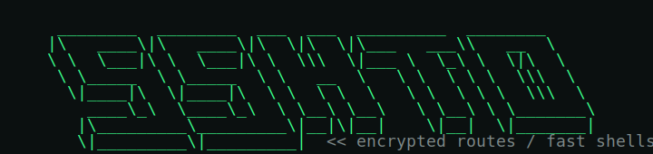
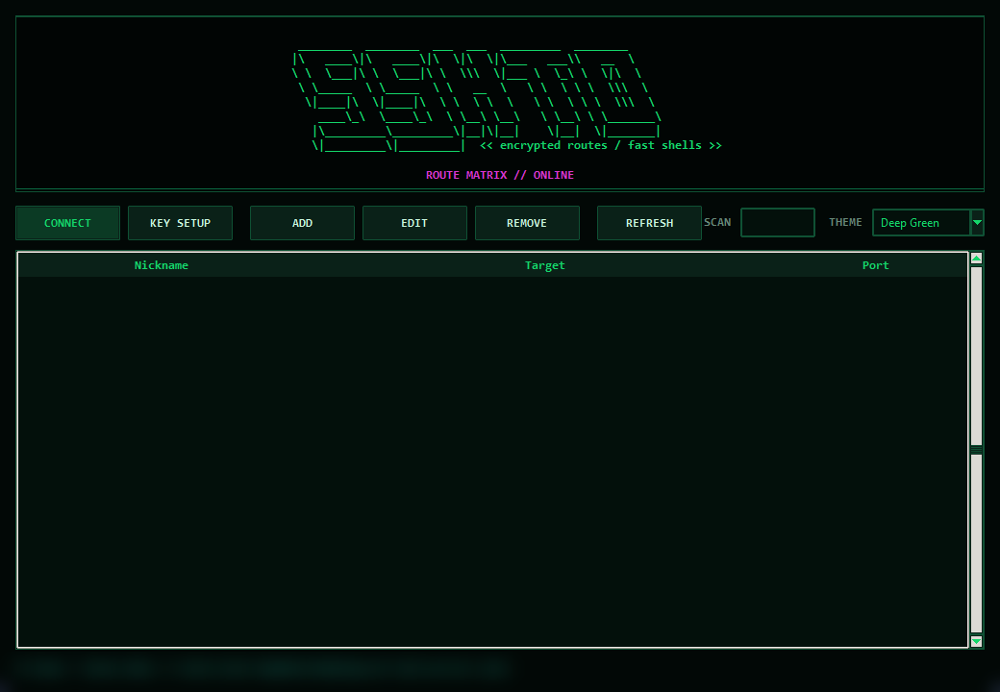
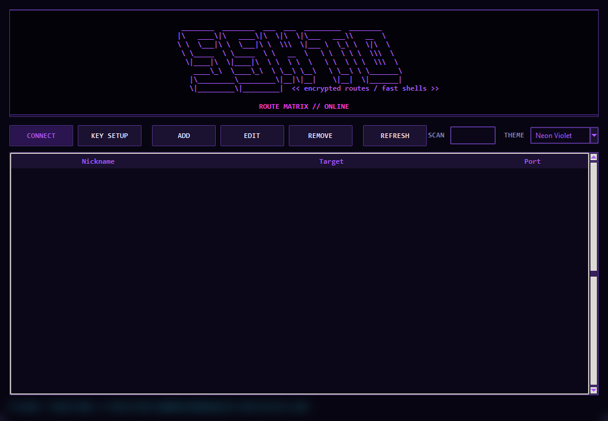
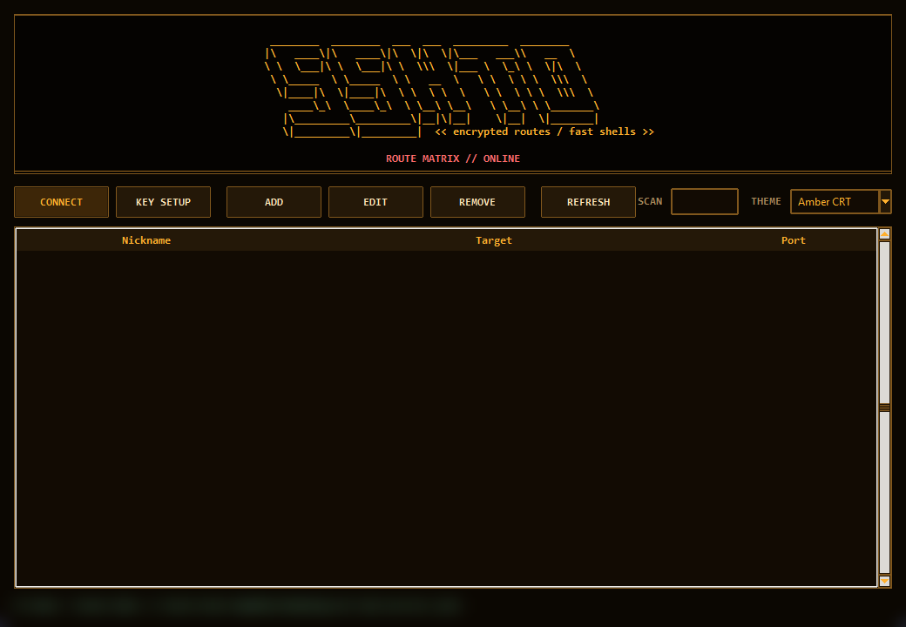
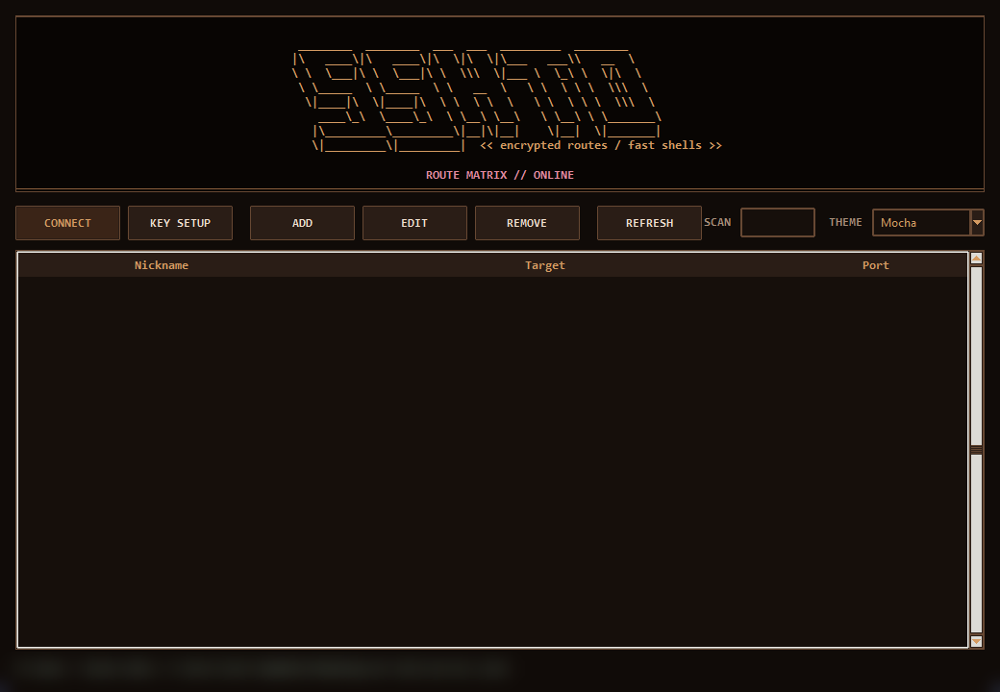
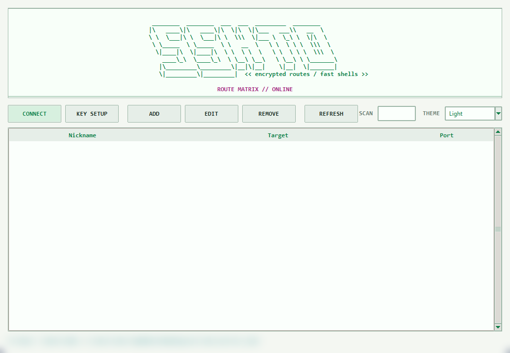
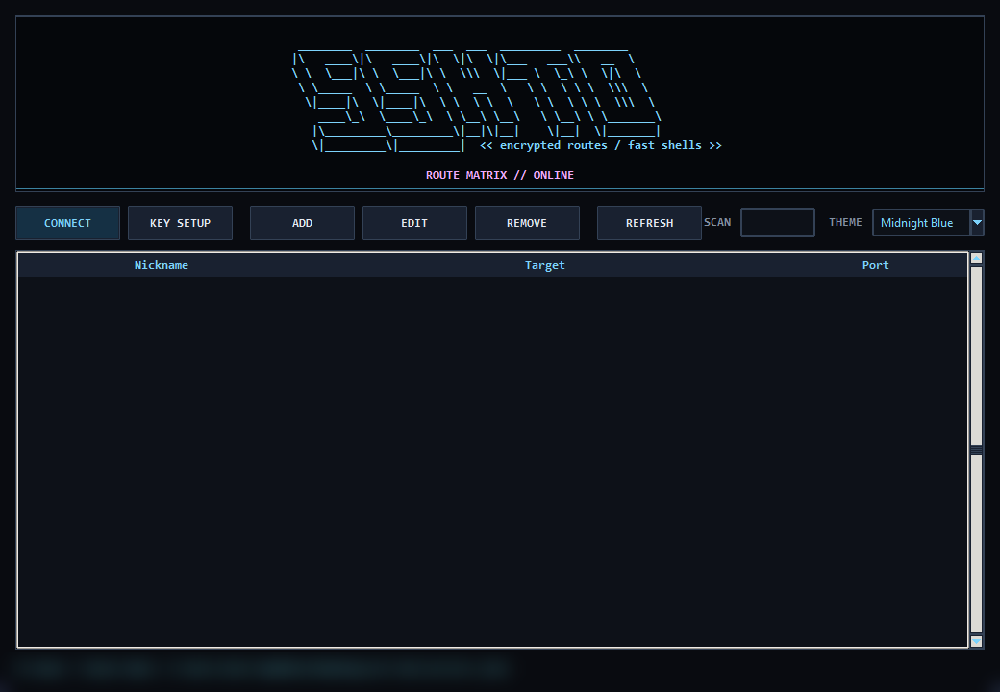
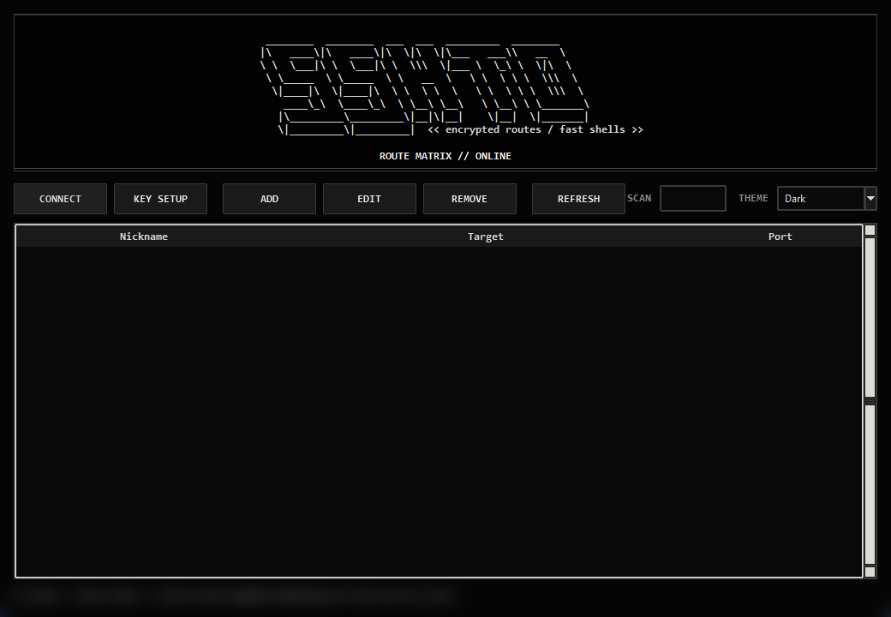

<p align="center">
  
</p>

# SSHTO

Quick SSH launcher for Windows and Linux.

`sshto.exe` on Windows and `sshto` on Linux let you save SSH server nicknames, list them, connect quickly, and set up SSH key login from the command line.

## Install

### Windows CLI

Run in PowerShell:

```powershell
irm https://github.com/icantenosh/SSHTO/raw/main/install.ps1 | iex
```

Restart PowerShell, then run:

```powershell
sshto help
```

### Windows GUI

Run in PowerShell:

```powershell
irm https://github.com/icantenosh/SSHTO/raw/main/install-gui.ps1 | iex
```

Restart PowerShell, then run:

```powershell
sshto-gui
```

### Linux GUI + CLI

Run in a terminal:

```bash
curl -fsSL https://github.com/icantenosh/SSHTO/raw/main/install-gui.sh | sh
```

Then run:

```bash
sshto-gui
```

or:

```bash
sshto help
```

### Linux CLI Only

```bash
curl -fsSL https://github.com/icantenosh/SSHTO/raw/main/install.sh | sh
```

## Commands

```bat
sshto                              Open the saved-server picker
sshto <nickname>                   Connect to a saved server
sshto add <nickname> <user@host>    Add or update a saved server
sshto add <nickname> <user@host> <port>  Add or update with a custom port
sshto keysetup <nickname>           Install your SSH key on a server
sshto list                         List saved servers
sshto ls                           Same as list
sshto remove <nickname>            Remove a saved server
sshto rm <nickname>                Same as remove
sshto help                         Show help
sshto -h                           Same as help
sshto --help                       Same as help
```

## GUI

### Windows

The GUI uses the same saved server file as the command-line tool and can add,
edit, remove, connect, and run SSH key setup. Server data stays at:

```bat
%APPDATA%\ssh-tool\servers.json
```

Theme selection is persistent and saved per Windows user.

### Linux

The Linux installer puts `sshto-gui` and `sshto` in `~/.local/bin` and installs
common dependencies when your package manager is supported. Run the GUI with:

```bash
sshto-gui
```

If you prefer apt, add the SSHTO repository once:

```bash
echo 'deb [trusted=yes] https://raw.githubusercontent.com/icantenosh/SSHTO/gh-pages stable main' | sudo tee /etc/apt/sources.list.d/sshto.list
sudo apt update
sudo apt install sshto-gui
```

The Linux GUI uses the same saved server file as the Linux command-line tool:

```bash
${XDG_CONFIG_HOME:-$HOME/.config}/ssh-tool/servers.json
```

It can add, edit, remove, search, connect, and run SSH key setup. Key setup asks
for the server password in the GUI and installs your public key without opening a
terminal. Connecting opens
your saved server in a terminal emulator such as `x-terminal-emulator`,
`gnome-terminal`, `konsole`, `xfce4-terminal`, or `xterm`.

### GUI Themes

| Deep Green | Neon Violet |
| --- | --- |
|  |  |

| Amber CRT | Mocha |
| --- | --- |
|  |  |

| Light | Midnight Blue |
| --- | --- |
|  |  |

| Dark |
| --- |
|  |

## Examples

```bat
sshto add demo-server demo@server.test
sshto keysetup demo-server
sshto demo-server
sshto list
```

## Saved Data

On Windows, server data is stored per Windows user at:

```bat
%APPDATA%\ssh-tool\servers.json
```

Saved passwords are encrypted with Windows DPAPI for the current Windows user. SSH key login is recommended.

On Linux, server data is stored at:

```bash
${XDG_CONFIG_HOME:-$HOME/.config}/ssh-tool/servers.json
```

The Linux version does not store passwords. Use `sshto keysetup <nickname>` to install your SSH public key.

## Notes

- `sshto.exe` requires Windows PowerShell and Windows OpenSSH.
- `sshto` for Linux requires Bash, Python 3, and OpenSSH.
- `install-gui.sh` installs the standalone Linux GUI plus common dependencies when your package manager is supported.
- Password auto-login is only possible if `plink.exe` is installed and available on `PATH`.
- `keysetup` is the preferred way to avoid typing server passwords.
